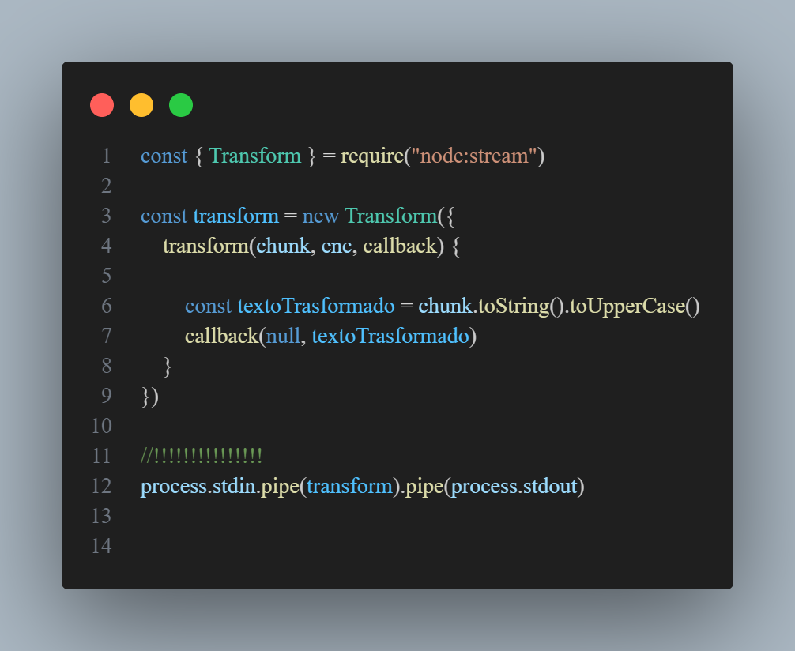

# 🥊 Reconstruindo o Objecto console do Javascript com process.stdout 

Neste projecto trago a recriação de alguns metódos do objecto **console** do Javascript, a ideia que na realidade foi curiosidade surgiu durante os meus estudos sobre **Node.js Streams**. Usando eu **pipe** para conectar streams ao process.stdout percebi que eu obtinha o mesmo resultado do **console.log** e quis enteder mais para poder replicar assim o **console.log**. Exemplo de código com **process.stdout**:



## 🧨 Metódos Clonados

 * **.log()**
 * **.info()**
 * **.warn()**
 * **.error()**

## 🏅 Metódo adicionado
 * **.especial()** --> Permite ao usuário escolher qual será a cor de saída, recebe como primeiro argumento um objecto contendo a cor desejada e o próximo argumento será a string

 ```js
 myConsole.special({color:"green"}, "Teste")
```
**Obs**: Não possui suporte a todas as cores.
## 🚀 Tecnologia Utilizada

* Node.js

## Author

**Bernardino Ivanel Leite Manuel**
